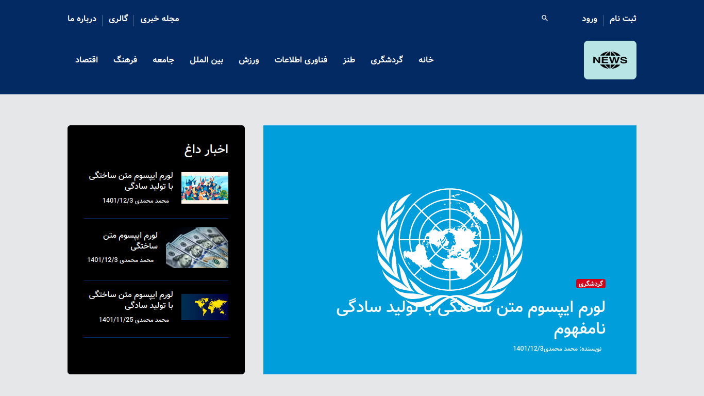
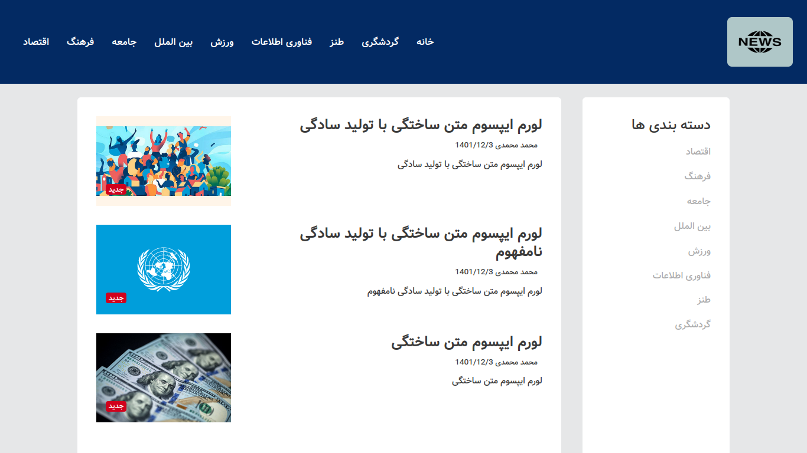
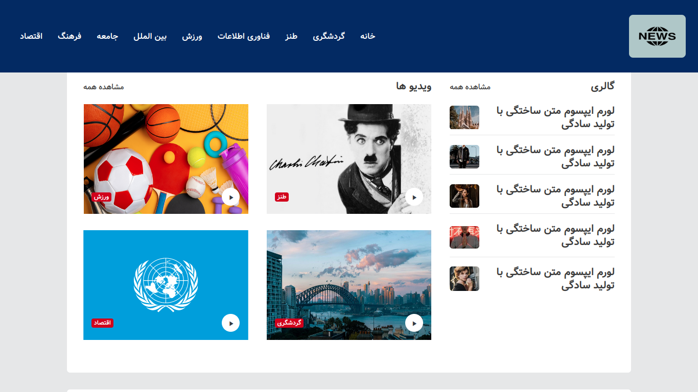
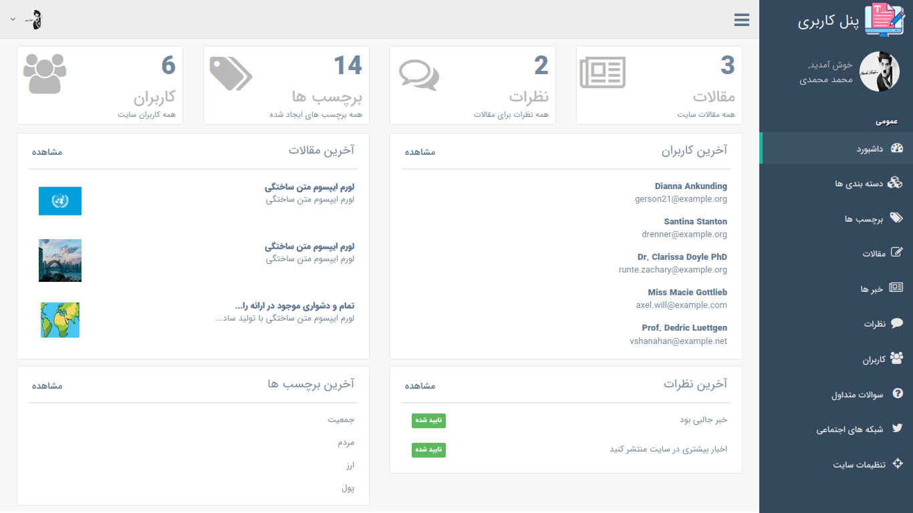

## About InfoDaily Hub

#### Complete Persian News Portal

News Portal is an online communication medium for internet
users which are read all over the world. The news
portal development allows to publish publications, press
releases, columns, articles, blogs and other news related
content.
A news portal is an access point to news; This is generally
thought of as a Internet connection to a news source but
the definition of a “Portal” would include a newspaper,
magazine or any other access to news. A web portal is any
access point to the Internet.


## Preview


### Main Page - Main Section


### Main Page - Category Section


### Main Page - Gallery Section


### Dashboard

##### powered by [@Laravel](https://laravel.com)
__________________________________________________

## How to run this project


----------------------------

### Setup

> first step clone this project (recommend) or download it, then:

#### setup composer
```
composer install
```

### **copy .env.example file to .env**


#### **generate application key**
```
php artisan key:generate
```

#### **create database and then migrate the tables**
```
php artisan migrate
```

#### **also setup node**
```
npm install
```

#### **then** 
```
npm run dev
```

#### **eventually serve the project**
```
php artisan serve
```
___
### **_Application is ready! enjoy :)_**

### **finally, remember to give to star this project. thanks. :D**
